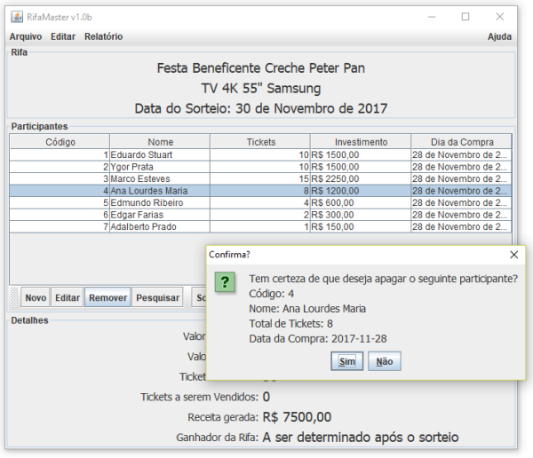

### RifaMaster
##### Gerenciador de Contribuições Voluntárias para Fins Beneficentes com a Possibilidade de Resgatar um Prêmio Mediante Sorteio

 

#### Sobre
Sistema desenvolvido por **Eduardo Stuart**, sendo apresentado para o público no segundo semestre de 2017 nas dependências da **Universidade Veiga de Almeida - Campus Centro**.

Idealizado e desenvolvido como o objetivo de demonstrar o desenvolvimento de sistemas usando a **Programação Orientada a Objetos**, o padrão de arquitetura **MVC** (*Model-View-Controller*) e uma interface gráfica que fosse intuitiva e amigável.

Projeto final para a disciplina **Programação Orientada a Objetos**, ministrada pelo mestre **Marco Aurélio Novaes Esteves** para a **Universidade Veiga de Almeida**.

As funcionalidades de todo o sistema e a sua interface gráfica foram desenvolvidos usando somente as bibliotecas nativas do **JAVA 8**.

Detalhes dessa apresentação podem ser conferidas no seguinte documento:
[RifaMaster: Apresentação em PDF](https://github.com/stuarteduardo/rifamaster/blob/master/RifaMaster.pdf)
